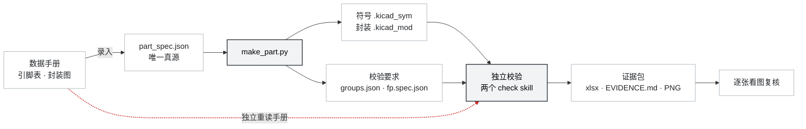

# kicad-hardware-toolkit

从数据手册生成 KiCad 元件（原理图符号 + PCB 封装），并对产物做独立校验。



图上三处值得点出：

* `make_part.py` 出两样东西，不是一样。除了符号和封装，它还吐出
  `groups.json` 与 `fp.spec.json` —— 把**要求**交给校验侧。校验器拿到要求
  才能独立地量；否则只能复述生成器自己的说法。
* 红色虚线是整套设计的支点。校验**不读**生成器写出的文本，而是独立
  重读手册：封装量 Gerber，符号的引脚名与电气类型取网表与 ERC。
  两条路读同一份手册、可以互相矛盾，这才叫校验。
* 末端的看图复核不可省。数值全对不代表能用 —— 四角压字、测量图标错
  对象这一类问题，所有数值通路都是绿的。报告里只能写"数值项 PASS，
  目视项待确认"。两个校验器都会读 `.kicad_mod` / `.kicad_sym` ——
  前者用于内联成测试板，后者用于搭建原理图；但读进来的内容不参与取值。

## 组件

| 组件 | 职责 | 产出 |
|---|---|---|
| `kicad-create-lib-part` | 由 `part_spec.json` 生成元件 | `LIB.kicad_sym`、`LIB.pretty/FP.kicad_mod`，以及校验所需的 `LIB.groups.json` / `LIB.fp.spec.json` |
| `kicad-check-sch-component` | 校验符号：绘制规范、网表、ERC、与手册比对、渲染、引脚契约 | `<符号>_pins.xlsx`（引脚比对表，需 `--pdf`）、`EVIDENCE.md`、`look_sheet.png`、`lint.txt`、`cmp_pins.json`、`<符号>.kicad_sch` / `.net` / `.erc.rpt`、`sym/*.png` |
| `kicad-check-pcb-component` | 校验封装：Gerber 量测、DRC、3D 实物贴合、渲染、引脚契约 | `<名称>_report.xlsx`（尺寸测量表，需 `--spec`）、`EVIDENCE.md`、`look_sheet.png`、`board.kicad_pcb`、`gerber/*`（9）、`drc.rpt`、`fit3d_*.png`、`fp/*.png`、`measure/*.png` |

两份 xlsx 的文件名：符号侧取符号名；封装侧取 `--name`，未给时取封装名。
另有少量中间文件供复现（`_spec_resolved.json`、`board.kicad_prl`）。
两个校验器不产出元件库交付物（`.kicad_sym` / `.kicad_mod`），
它们只读这两类文件 来建板与建原理图；
表中的量测值与比对结果均不取自这些文本（见上图虚线）。
生成器与校验器分离是硬约束：若生成侧也做"看着没问题"的判断，校验即退化为自证。
生成器只保证产物能被 `kicad-cli` 加载。

## 校验通路

封装校验由四条互不重叠的通路组成，外加一条与符号交叉的契约。任一条单独运行
都无法发现其余通路能发现的问题。

| 通路 | 输入 | 可发现的缺陷 |
|---|---|---|
| 量测 | Gerber / Excellon 反解 | 焊盘尺寸、跨距、间距错误 |
| 规则 | `kicad-cli pcb drc` | 丝印压阻焊、外框缺失或过小、间距不足 |
| 实物 | `kicad-cli pcb render` + STEP 模型 | 图纸数字与实际器件不符 |
| 目视 | 渲染为 PNG 后逐张查看 | 布局意图类错误（唯一覆盖此类的通路） |
| 契约 | 焊盘号与符号引脚号交叉 | 两侧编号不一致（跨 artifact，非第四条）|

符号校验的通路为：绘制规范（纯几何）、`sch export netlist`、`sch erc`、与手册
Table 5-1 三方比对、渲染目视。其中 ERC 是唯一能发现电气类型错误的手段
（类型写错不影响任何几何量测）。验收要求：未查看渲染图不得声称"已验证"；
报告里只能写"数值项 PASS，目视项待确认"。清单见
[`shared/render-and-look.md`](shared/render-and-look.md)。

## 环境要求

| 依赖 | 用途 | 获取方式 |
|---|---|---|
| Python ≥ 3.9 | 全部脚本 | — |
| `kicad-cli` ≥ 8 | Gerber/网表导出、DRC/ERC、3D 渲染 | 随 KiCad 安装 |
| Chromium 内核浏览器 | SVG 转 PNG（无头模式） | Chrome 或 Edge |
| `pdfplumber` | 从手册 PDF 抽取引脚表 | `pip install -r requirements.txt` |
| `openpyxl` | 尺寸测量表输出 | 同上 |
| `Pillow` | 测量图绘制与拼接 | 同上 |

工具路径自动探测，可用 `KICAD_CLI` / `CHROME` 覆盖。
设置的值无效时脚本直接报错，不回退到自动探测。

```bash
python shared/toolchain.py        # 打印探测到的路径
```

## 安装

pi：

```bash
pi install /path/to/kicad-hardware-toolkit
```

其他 Agent Skills 实现（Claude Code / Codex 等）—— 三个 skill
使用标准目录结构，指向即可：

```bash
ln -s /path/to/kicad-hardware-toolkit/skills/kicad-create-lib-part ~/.claude/skills/
```

不使用 agent 时可直接调用脚本，见下节。

## 使用

### 1. 编写 spec

以 `skills/kicad-create-lib-part/assets/part_spec_template.json` 为模板。
三部分从图纸录入：

- `pins[]` —— 手册 Pin Functions 表的引脚号、名称；**电气类型与所在边**
  （手册不提供，由 AI/LLM 判）
- `groups{}` —— 功能分组（手册不提供，由 AI/LLM 判）
- `package{}` —— 手册 Package Outline 与 Example Board Layout 的尺寸

> 引脚间距固定 200 mil / 组间 400 mil，全库统一，不按器件改。
> 详见 [skills/kicad-create-lib-part/references/symbol-rules.md](skills/kicad-create-lib-part/references/symbol-rules.md)。组内顺序由 `pins[]` 的书写顺序决定，组间顺序由 `groups{}` 决定。

### 2. 生成

```bash
TK=/path/to/kicad-hardware-toolkit
python $TK/skills/kicad-create-lib-part/scripts/make_part.py spec.json --outdir out --verify
```

`--verify` 调用 `kicad-cli` 确认产物可加载，并打印后续校验命令。

### 3. 校验

```bash
python $TK/skills/kicad-check-sch-component/scripts/check_symbol.py \
       out/LIB/LIB.kicad_sym --outdir chk_sch \
       --pdf datasheet.pdf --groups out/LIB.groups.json \
       --footprint out/LIB.pretty/FP.kicad_mod

python $TK/skills/kicad-check-pcb-component/scripts/check_footprint.py \
       out/LIB.pretty/FP.kicad_mod --outdir chk_pcb \
       --spec out/LIB.fp.spec.json --symbol out/LIB/LIB.kicad_sym
```

两份 Excel 检查表：

| 文件 | 形状 | 数据来源 |
|---|---|---|
| `chk_sch/<符号>_pins.xlsx` | `pin \| 手册名 \| 网表名 \| 手册类型 \| ERC类型 \| 结果` | 手册 Table 5-1（要求） vs 网表名 + ERC 类型（实测） |
| `chk_pcb/<名称>_report.xlsx` | `index \| 要求:图片 \| 要求:数值 \| 实际测量:图片 \| 实际测量:数值 \| 结果` | 图纸尺寸（要求） vs Gerber/Excellon 反解（实测） |

两个命令还各产出 `EVIDENCE.md`（逐项结论与数据来源）和 `look_sheet.png`
（所有图拼成一张）。审阅 `look_sheet.png`、`fit3d_*.png` 后再下结论。
引脚比对表只在给了 `--pdf` 时生成 —— 没有手册就没有"要求"一列。规格检查（间距
/ 分组 / 栅格 / 本体）的结果在 `lint.txt` 与 `EVIDENCE.md` 里，不重复进 xlsx。

## 退出码

| 脚本 | 0 | 非 0 |
|---|---|---|
| `make_part.py` | 成功 | 2 输入/参数错误；3 产物无法被 kicad-cli 加载 |
| `check_footprint.py` | 全部通过 | 6 存在 NG 项 |
| `check_symbol.py` | 全部通过 | 9 存在 NG 项 |
| `measure_component.py` | 无 NG 行 | 1 有 NG 行；2 找不到 Gerber |
| `drc.py` | 无相关违规 | 6 存在违规 |
| `fit3d.py` | 已渲染 3D 贴合图 | 7 STEP 模型缺失（不渲染） |
| `pinmap.py` | 编号一一对应 | 8 不一致 |
| `symbol_lint.py` | 无 FAIL | 1 存在 FAIL |
| `pdf_pins.py` | 引脚类型全已映射 | 1 存在未映射项 |
| `selftest.py`（三个） | 全部通过 | 1 存在失败用例 |

所有入口的未捕获异常统一由 `shared/cli.py` 转换为可读信息并返回 2；加
`--traceback` 或设 `TOOLKIT_TRACEBACK=1` 可取完整堆栈。

## 设计约定

以下四条影响使用方式，非实现细节。引脚间距固定 200 / 400 mil，全库统一，
不按器件改。这不是默认值而是风格 约定：同一个库里混着 100 mil 和 200 mil
的符号，读图的人每换一颗器件都要重新 建立比例感。官方库偏好 100
mil（STM32/ATmega/PCA9555 量出来都是 2.54mm），但那是他们的风格。
代价是引脚多时符号很大（49 脚 → 实体 55.9 × 121.9 mm），认了；真嫌大就重排
`groups{}` 把两侧配平，不要改 pitch。 `make_part.py` 会对偏离发警告，详见
[references/symbol-rules.md](skills/kicad-create-lib-part/references/symbol-rules.md)。
间距值必须是 100 mil 的整数倍。这是几何硬约束，与上一条不同。
顶对齐时首个引脚的 y 坐标为最大跨度的一半； `pitch_mil=150` /
`group_gap_mil=300` 会产生 9.525 mm，不在 50 mil 连接栅格上，
导致引脚无法连线，而符号外观完全正常。`make_part.py` 生成后会自检并告警。
分组必须显式声明 —— 由 AI/LLM 判。 "组间 400 mil" 这条规则在几何上不可 判定：
左侧 `VBUS(12.7) ─400mil─ IN+(2.54) ─200mil─ IN−(−2.54)` 中将 `IN+` 移至
7.62，即变为 `200mil / 400mil`，两种排列都满足"组内 200 / 组间 400"，
仅分组不同。因此分组是输入而非推断结果（而"该分哪几组"这个语义判断，由 AI/LLM
从手册上下文得出）。未提供分组时脚本会明确报告该规则未校验，
并把几何推断出的分组与声明的分组对账，不一致即判 FAIL。
判定同时依据返回码与输出文本。 `kicad-cli pcb drc` 在存在违规时返回码可能为 0
（除非加 `--exit-code-violations`）；加载失败返回 2，成功时输出"未更新"。
仅凭返回码会漏判。

## 目录结构

```
kicad-hardware-toolkit/
├── package.json                    pi 包清单
├── requirements.txt
├── .github/workflows/test.yml      CI
├── shared/                         三个 skill 共用，**只有一份**
│   ├── toolchain.py                外部工具定位（kicad-cli 等）
│   ├── cli.py                      入口错误处理与退出码
│   ├── render.py                   渲染：SVG→PNG、3D
│   ├── pinmap.py                   引脚↔焊盘契约
│   ├── kitext.py                   KiCad 文本渲染常数（create 与 check-sch 共用）
│   └── render-and-look.md          目视清单与结论措辞规范
└── skills/
    ├── kicad-create-lib-part/
    │   ├── SKILL.md
    │   ├── assets/part_spec_template.json
    │   ├── references/             symbol-rules, footprint-rules,
    │   │                           kicad-formats, datasheet-extract,
    │   │                           internals (维护用)
    │   └── scripts/                make_part.py, kicad_io.py, selftest.py
    ├── kicad-check-sch-component/
    │   ├── SKILL.md
    │   ├── assets/groups_template.json
    │   ├── references/             checks.md, internals (维护用)
    │   └── scripts/                check_symbol, symbol_lint, sch_build,
    │                               sch_netlist, sch_erc, pdf_pins,
    │                               pin_report, selftest
    └── kicad-check-pcb-component/
        ├── SKILL.md
        ├── assets/spec_template.json
        ├── references/             families.md, internals (维护用)
        └── scripts/
            ├── check_footprint, measure_component, drc, fit3d,
            │   selftest, build_testboards, crop_spec_table
            ├── core/               gerber, geometry, spec, draw,
            │                       common, report, board
            └── families/           grid_array, peripheral, chip
```

`core/` 与封装类型无关；`families/` 按封装族划分（网格阵列 / 边引脚 / 两端子）
，定位问题时据此缩小范围。

> `render.py` / `pinmap.py` / `kitext.py` 在 `shared/`，不在任何 skill 的
> `scripts/` 下。从某个 skill 目录引用时用 `../../shared/xxx.py`。

## 测试

三个 selftest 不需要 CAD 文件与网络。量测用例仅依赖标准库；绘制相关用例需要
Pillow，缺失时标记为跳过而非通过。

```bash
python skills/kicad-check-pcb-component/scripts/selftest.py    # 110 项
python skills/kicad-check-sch-component/scripts/selftest.py    #  41 项
python skills/kicad-create-lib-part/scripts/selftest.py        #  87 项
```

针对真实 KiCad 库封装的集成测试（需要 KiCad）：

```bash
python skills/kicad-check-pcb-component/scripts/build_testboards.py /tmp/tb --run --3d
```

### 改 SKILL.md 前先跑一下 frontmatter 检查

CI 卡的判据（`.github/workflows/test.yml` 的 `skill-frontmatter`）：

* `name` 只能是小写字母 + 数字 + 连字符，且**必须等于目录名**；
* **`description` ≤ 1024 字符** —— 这条容易踩：description 既给人看又给
  模型做技能选择，很容易写长。现在三个是 795 / 764 / 770，余量够；
  改之前先量一下。

  > description 是**唯一常驻上下文**的东西（SKILL.md 只在触发时加载）。
  > 写的时候只留两样：**是干什么的** + **什么时候该用**（把各种叫法都列上，
  > 比如 `元器件尺寸测量表 / 尺寸检查表 / dimension inspection report`）。
  > 实现细节（内部几步、产出文件清单）对选择没帮助，只稀释触发词。

```bash
python - <<'PY'
import pathlib, re
for d in sorted(pathlib.Path("skills").iterdir()):
    f = d / "SKILL.md"
    if not f.exists(): continue
    fm = f.read_text(encoding="utf-8").split("---")[1]
    n = len(re.search(r"^description:\s*(.+)$", fm, re.M).group(1))
    print("%-28s description %4d / 1024  %s" % (d.name, n, "✗ 超了" if n > 1024 else "✓"))
PY
```

CI 在每次 push 时运行上述三个 selftest（py3.9 / 3.12 / 3.13）、pyflakes，以及
SKILL.md frontmatter 校验（名称须为小写连字符且与目录名一致， description ≤
1024 字符 —— 这是 Agent Skills 标准的要求，pi 本身较宽松）。

## 已知限制

- **无实物验证。** 最终确认需要把器件焊到板上。
- 图纸录入错误无法检出。量测只能证明"封装与 spec 一致"。若 spec 中的数值录入
  有误，所有校验会一致通过。当前缓解手段是 spec 内的**块级**来源注记 （如
  `_package_说明` 记录图纸号），**没有**做到逐值注记。
- 符号的跨引脚电气冲突未检查。当前为"孤立符号 ERC + 电气类型提取"，检出短路类问题需要构造测试台原理图。
- **四边封装（QFP / QFN）** 已有 selftest 覆盖，但尚未用真实厂家图纸走完整流程。
- **Z 向尺寸不可测。** 2D Gerber 无该方向几何，一律报"待测"。
- **封装族覆盖不均。** 边引脚与两端子族经真实数据回归；网格阵列族仅有合成测试。

## 许可

MIT
